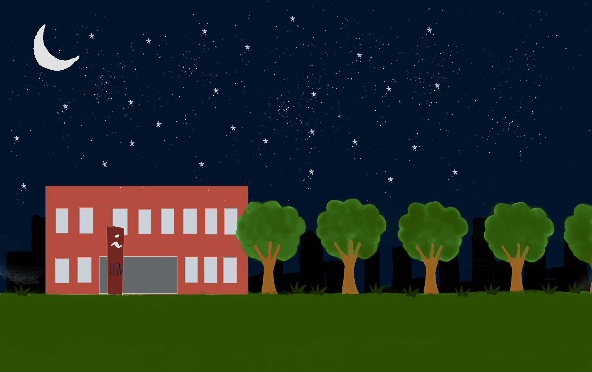
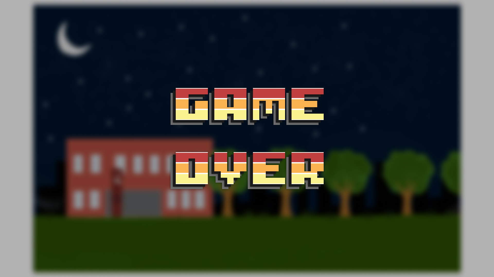

### Silas Pilgrim vs The CIn - Readme

## Equipe

- **Hugo Coelho** (hcbl)
- **Jorge Guilherme** (jglvc)
- **Renata Micaelly** (rmps)
- **Silas Manoel** (smfs)
- **Sofia Ribeiro** (srs2)
- **Vinícius França** (vsf2)

## Descrição do Jogo

*Silas Pilgrim vs The CIn* é um jogo 2D desenvolvido em Python com a biblioteca Pygame. No jogo, o personagem principal, Silas, enfrenta obstáculos no Centro de Informática, como greves e listas difíceis. Silas começa o jogo com 3 vidas, que perde ao bater em obstáculos, e deve coletar amigos ao longo do percurso. O jogo é vencido e o jogador avança para o próximo período ao coletar todos os amigos sem perder todas as vidas.

## Arquitetura do Projeto e Organização do Código

O código está organizado no diretório `assets/scripts/`, contendo os seguintes módulos:

- `collectibles`
- `game_platform`
- `menu`
- `obstacles`
- `player`

O arquivo `main` está localizado na raiz do projeto.

## Capturas de Tela

## Ferramentas, Bibliotecas e Frameworks

- GitHub
- Pygame
- VSCode
- Programação Orientada a Objetos (POO)
- PixilArt

## Divisão de Trabalho

### Equipe de Design e Implementação

- Renata Micaelly (rmps)
- Sofia Ribeiro (srs2)

### Equipe de Mecânica

- Jorge Guilherme (jglvc)
- Silas Manoel (smfs)

### Equipe dos Coletáveis

- Hugo Coelho (hcbl)
- Vinícius França (vsf2)

## Sprints

### Sprint 1

- Criação do repositório
- Idealização do jogo
- Definição do líder
- Nivelamento da equipe
- Seleção das bibliotecas
- Divisão de tarefas e estabelecimento de metas
- Estudo de POO

### Sprint 2

- Divisão em duplas para tarefas
- Organização do Trello
- Criação do primeiro MVP
- Desenvolvimento das movimentações
- Desenvolvimento do design
- Atribuição dos NPCs e amigos do personagem

### Sprint 3

- Aperfeiçoamento do MVP
- Desenvolvimento de novas movimentações e animações
- Desenho dos NPCs, coletáveis e inimigos

### Sprint 4

- Implementação dos sprites e artes dos personagens
- Criação dos obstáculos
- Criação do menu

## Conceitos Aprendidos e Utilizados

Além dos conceitos já vistos em sala de aula, como listas, funções e estruturas de repetição, a equipe aprendeu e utilizou novas tecnologias:

- Programação orientada a objetos
- Biblioteca Pygame
- Versionamento de código com Git e GitHub
- Trabalho em equipe utilizando o gitflow

## Desafios, Erros e Aprendizados

### Desafios

- Conciliação do projeto com outras atividades
- Falta de conhecimento das bibliotecas necessárias para o jogo

### Erros e Aprendizados

- **GitHub**: Muitos membros nunca haviam utilizado Git/GitHub antes, não sabiam como dar commits, etc.
- **Pygame**: Dificuldades em entender as estruturas e funções da biblioteca.
- **Programação Orientada a Objetos**: Compreensão dos conceitos associados à POO foi um desafio para alguns membros.

---
